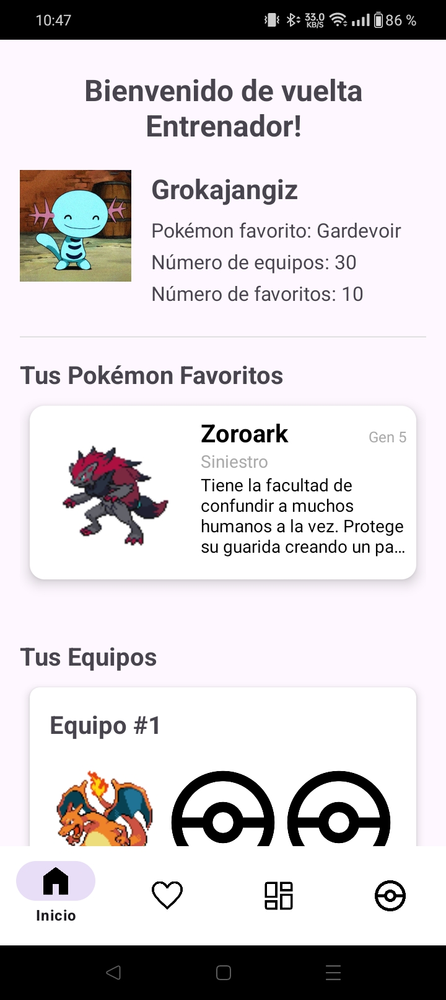
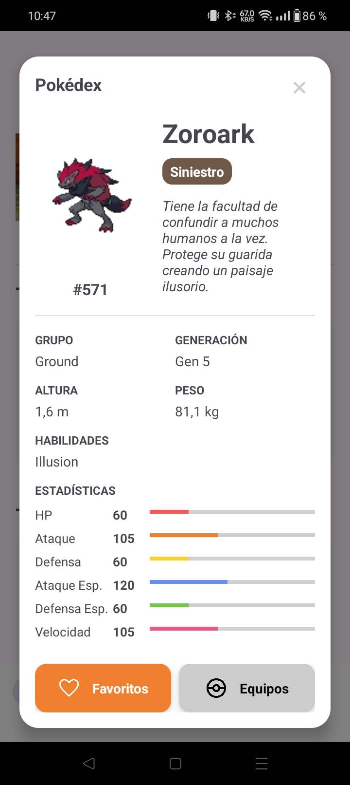
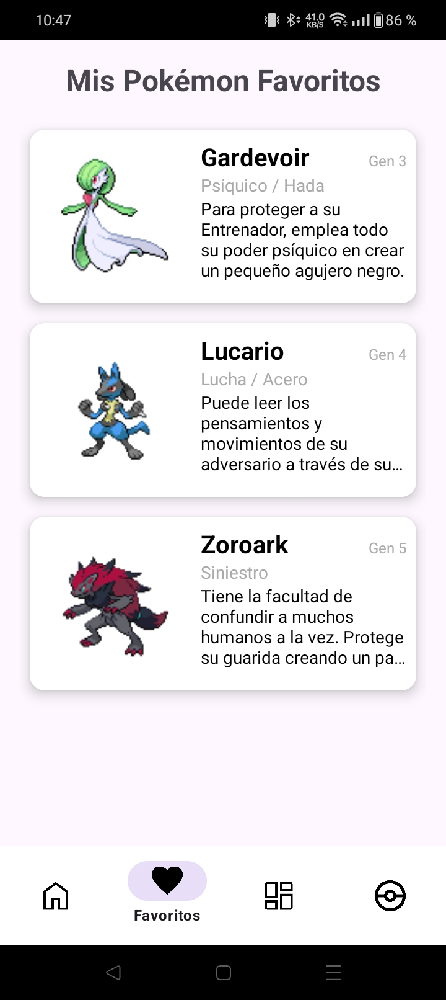
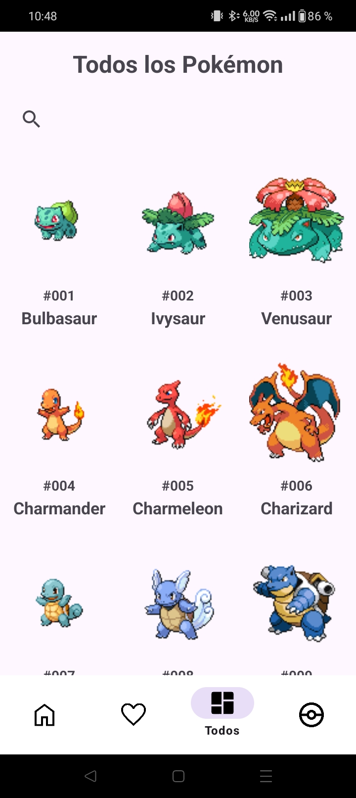
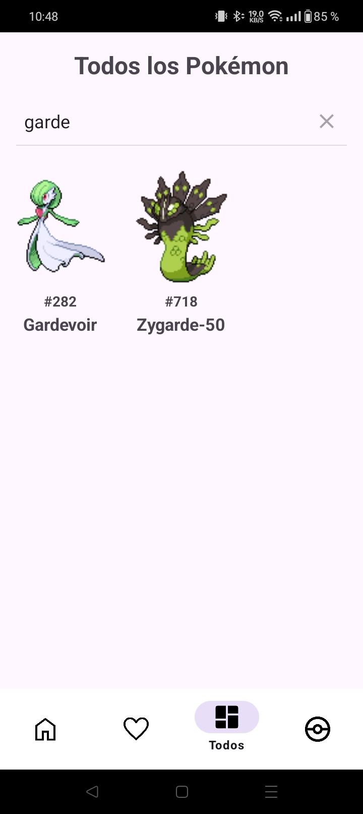
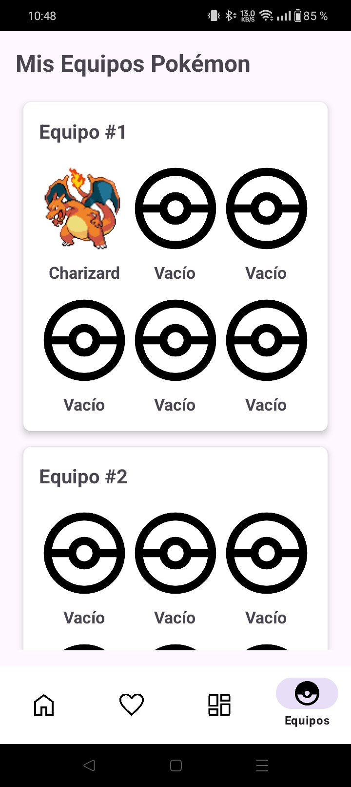
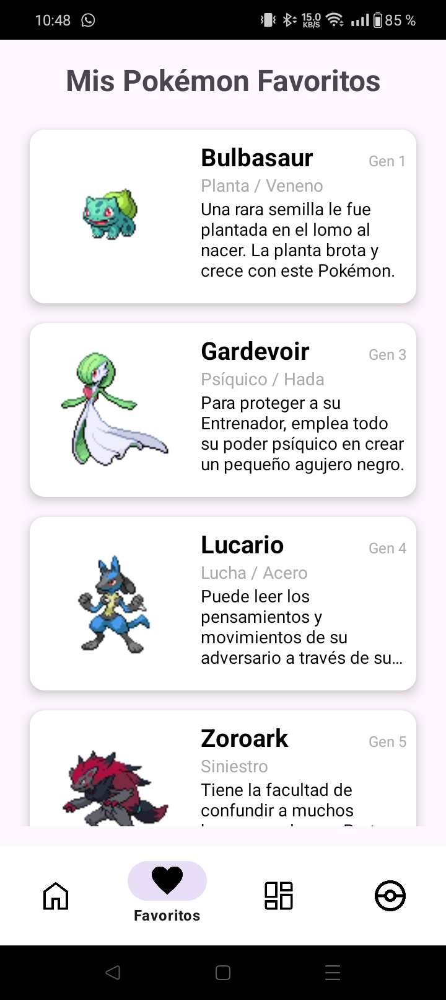

<h1 align="center">Project Dex</h1>

Una aplicación que funciona tanto como Pokédex como gestor de equipos y favoritos

<h2>📌 Descripción del proyecto</h2>

Una aplicación que recoge datos de la PokeAPI para permitir ver información de Pokémon, coleccionarlos, organizarlos y marcarlos como favoritos, así como hacer equipos

---

<h2>🛠️ Características principales</h2>

<ul>
  <li>Añadir y eliminar favoritos</li>
  <li>Crear equipos y añadir Pokémon</li>
  <li>Buscar información detallada de todos los Pokémon existentes</li>
  <li>Landing page visual con todos tus datos</li>
  <li>Servidor local hosteado en un teléfono</li>
</ul>

---

<h2>🖥️ Capturas de la aplicación</h2>

<h3>Landing page</h3>

<h3>Menú de información</h3>

<h3>Favoritos</h3>

<h3>Buscador</h3>

<h3>Busqueda</h3>

<h3>Equipos</h3>

<h3>Favoritos actualizado</h3>

---

<h2>🚀 Tecnologías utilizadas</h2>

<ul>
  <li>Java</li>
  <li>XML</li>
  <li>Android Studio</li>
  <li>SQLite</li>
  <li>Linux</li>
  <li>Termux</li>
</ul>

---

<h2>📌 Notas adicionales</h2>

Mi proyecto de segundo año de desarrollo para móviles, basado en uno de mis intereses. Una aplicación funcional y terminada por completo.

